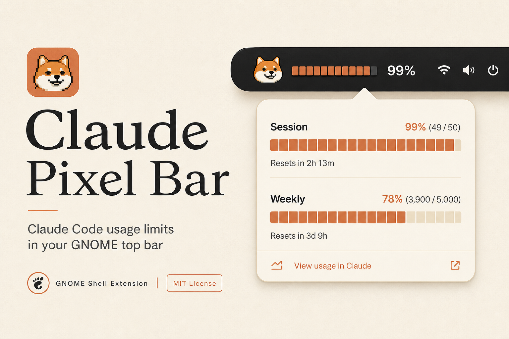
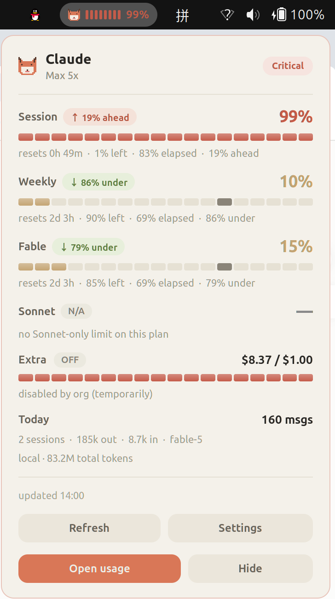
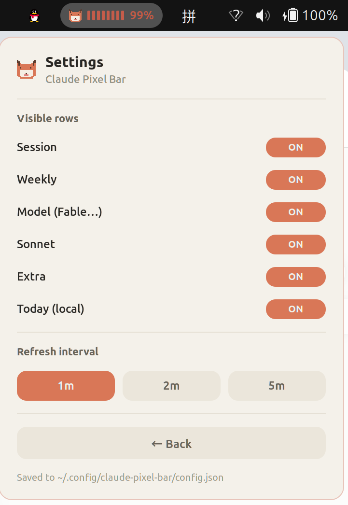

# Claude Pixel Bar

**Claude Code usage limits — cream pixel-art, right in your GNOME top bar.**

[](#requirements)
[](LICENSE)
[](https://github.com/mryll/claudebar)

<p align="center">
  
</p>

<p align="center">
  
</p>

Session · Weekly · model-scoped limits · Extra · local Today stats — with pacing badges, elapsed markers, and a one-click hide.

---

## Install

### 1. Install the data backend

This extension reads live usage through [`mryll/claudebar`](https://github.com/mryll/claudebar) (OAuth refresh + cache).

```bash
git clone https://github.com/mryll/claudebar.git
cd claudebar
make install PREFIX=~/.local
```

Confirm Claude Code is logged in (`claude` works) and:

```bash
claudebar   # should print Waybar JSON with your usage
```

### 2. Install the GNOME extension

```bash
git clone https://github.com/Evan715823/Claude-bar-for-linux.git
cd Claude-bar-for-linux
chmod +x install.sh
./install.sh
```

### 3. Reload GNOME Shell

| Session | How to reload |
|---------|----------------|
| **X11** | `Alt+F2` → type `r` → Enter *(English input method)* |
| **Wayland** | Log out and log back in |

Then look for the pixel dog in the top bar. Click it for the full card.

**Enable / disable later**

```bash
gnome-extensions enable  claude-pixel-bar@local
gnome-extensions disable claude-pixel-bar@local
```

---

## What you see

| Surface | Content |
|---------|---------|
| **Top bar** | Pixel dog · mini usage bar · session % (falls back to weekly) |
| **Popup** | Session / Weekly / model (e.g. Fable) / Sonnet / Extra / Today |
| **Pacing** | ↑ ahead · ↓ under · colored pills + elapsed marker on the bar |
| **Health** | Critical / High / Busy / Healthy badge |
| **Actions** | Refresh · Settings · Open usage · Hide widget |

<p align="center">
  
</p>

**Settings** (saved to `~/.config/claude-pixel-bar/config.json`):

- Toggle any row on/off  
- Refresh every **1m / 2m / 5m**

---

## Requirements

- Linux + **GNOME Shell 45 / 46 / 47**
- [`claudebar`](https://github.com/mryll/claudebar) in `PATH`
- Claude Code logged in (Pro / Max)
- Python 3 *(for local Today stats)*
- Optional fonts: [Press Start 2P](https://fonts.google.com/specimen/Press+Start+2P), [Manrope](https://fonts.google.com/specimen/Manrope)

---

## Privacy

- Reads Claude Code OAuth credentials via `claudebar` (same as the CLI).
- Calls Anthropic’s usage endpoint through `claudebar` (cached ~60s).
- **Today** scans local `~/.claude/projects/*.jsonl` only — no upload.
- Settings are local JSON. No telemetry.

---

## Uninstall

```bash
gnome-extensions disable claude-pixel-bar@local
rm -rf ~/.local/share/gnome-shell/extensions/claude-pixel-bar@local
# optional:
# rm -rf ~/.config/claude-pixel-bar
```

---

## Troubleshooting

| Symptom | Fix |
|---------|-----|
| Nothing in the top bar | `gnome-extensions enable claude-pixel-bar@local` then reload Shell |
| `claudebar not found` | Install [mryll/claudebar](https://github.com/mryll/claudebar) into `PATH` |
| Extra shows **OFF** | API reports `is_enabled: false` — org/account side, not a UI bug |
| Sonnet shows **N/A** | Your plan has no Sonnet-only weekly window (common on Max + Fable) |
| Stale / cached | Click **Refresh**, or wait for the next interval |

```bash
gnome-extensions info claude-pixel-bar@local
claudebar --format '{plan}|{session_pct}|{weekly_pct}'
```

---

## Credits

- Usage backend: [mryll/claudebar](https://github.com/mryll/claudebar)
- Inspired by the broader Claude / Waybar / macOS menu-bar usage ecosystem

## Disclaimer

**Unofficial community project.** Not affiliated with, endorsed by, or maintained by Anthropic.  
“Claude” and “Claude Code” are trademarks of Anthropic.  
The usage API is undocumented and rate-limited — keep refresh ≥ 60s.

## License

[MIT](LICENSE) © 2026 Evan715823
